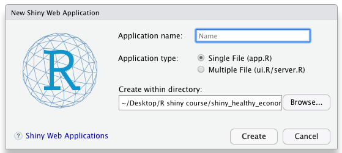
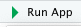
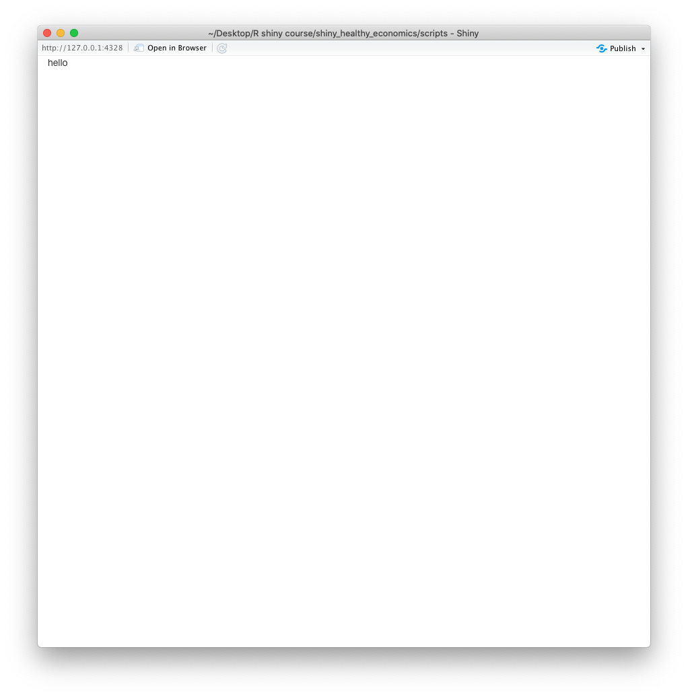
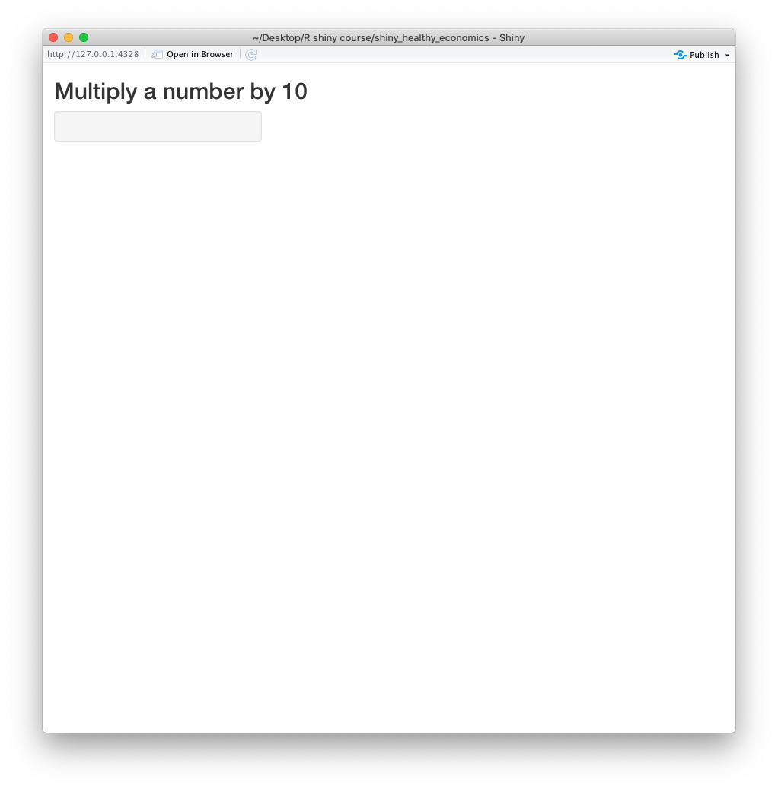
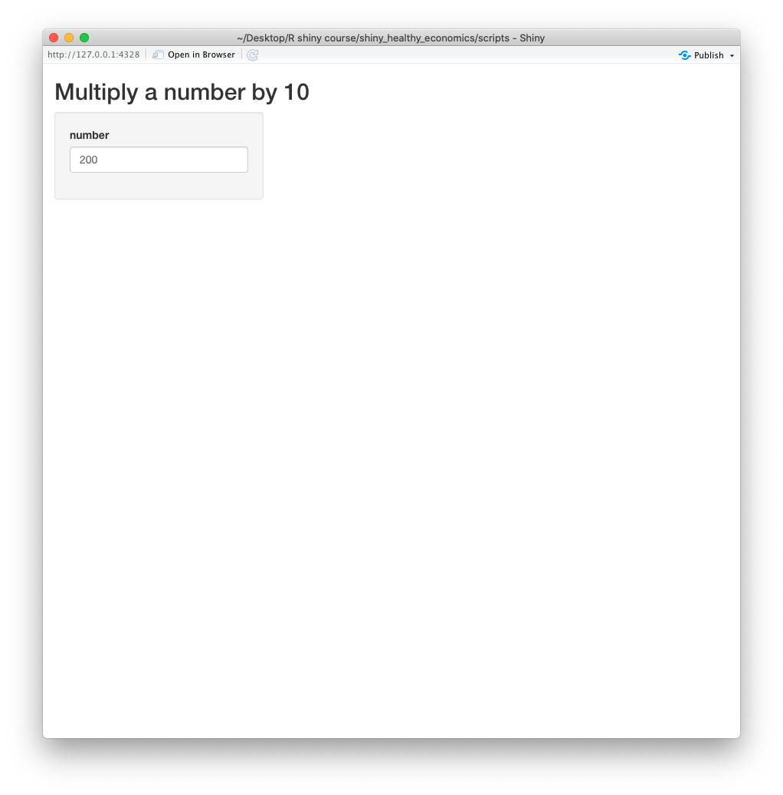
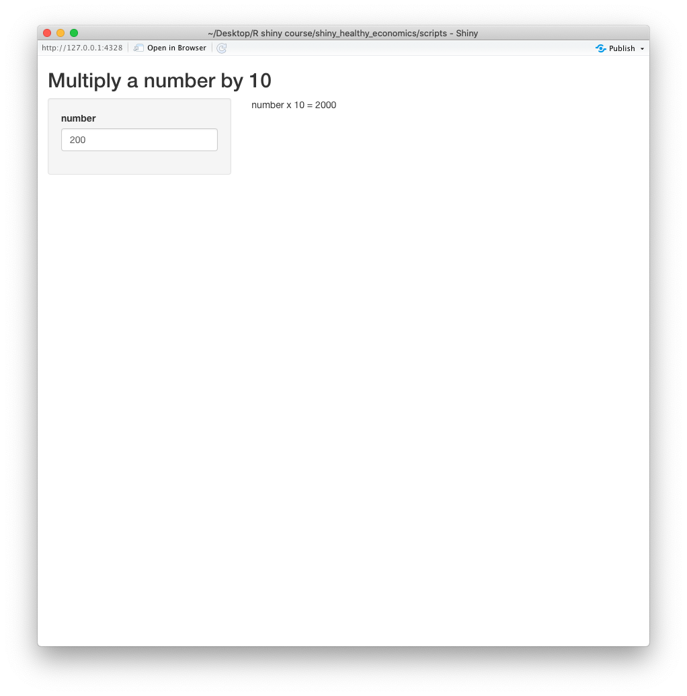
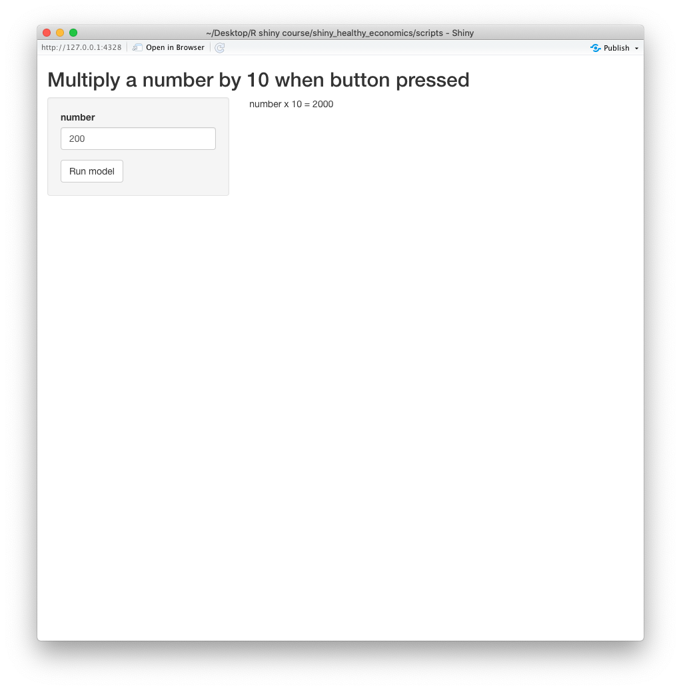

```{r include=FALSE}
knitr::opts_chunk$set(echo = TRUE)
```

## Introduction

This session will provide an introduction to R Shiny. R Shiny enables you to build a user-interface, or 'front end', to a health economic model. Users can then change model inputs and observe the impact on the outcomes. We will start with the basic functions used in R shiny, and build on these until you are ready to incorporate the health economic model discussed in the previous session.

### Resources

R Studio website: [https://shiny.rstudio.com/](https://shiny.rstudio.com/)

Examples of R Shiny apps: [https://shiny.rstudio.com/gallery/](https://shiny.rstudio.com/gallery/)

20 minute R Shiny tutorial: [https://shiny.rstudio.com/tutorial/](https://shiny.rstudio.com/tutorial/).

R Shiny 'cheat sheet': [https://shiny.rstudio.com/images/shiny-cheatsheet.pdf](https://shiny.rstudio.com/images/shiny-cheatsheet.pdf)


### Objectives

- Understand the user interface object and the server function

- Build a basic R shiny app

- Add inputs and outputs

- Add an action button

- Use functions within the app

- Add a reactive plot to the outputs

\newpage

## Running a shiny app 

### Load shiny package

The first step is ensure that you have the shiny package loaded (use install.packages("Shiny") if you've not already installed Shiny).

```{r}
library(shiny)
```

### Opening a new Shiny Web app

You can start a new shiny web app through the file --> New file --> Shiny web app menu options. This will open up a window in which you'll create a directory for your app, the script for the app will be saved inside that directory and the script for Shiny will be automatically saved as "app.R". This will be populated with a template for the Shiny app with example code 

{width=300 height=200px}

Alternatively you can open a new R script file and manually add the necessary functions which we'll describe in the next session.

It's important that, when creating a Shiny app, you ensure that any R files with functions you need to use (such as the wrapper function created in the previous session) are saved in the same directory.

### Structure of R Shiny App

There are two main functions that form the Shiny app. The user interface (ui) is the part of the script in which you can control the appearance of your app. Within this the function fluidPage() is used, which creates a display that automatically adjusts to the size of the browser window. You can control the layout of the app within this fluidPage function. In this ui, we specify inputs and outputs for the app.

The server function contains the code to create the outputs that form your app. This will become clearer as we develop increasingly complex shiny apps.

Here is the code for a very simple app with no inputs or outputs:

```{r}
#================================================================
#                   Create User Interface
#================================================================

ui <- fluidPage(    # create user interface using fluid-page function
  
  "hello"
  
) # close UI fluidpage


#================================================================
#                     Create Server Function
#================================================================

server <- function(input, output){   
  
  # server function

  
} # Server end

```

To run the app either:

1. Select the Run App button {width=45 height=30px}. 

2. Use the shinyApp function that creates the shiny app from the ui and server. 

```{r}
# shinyApp(ui, server)    
```

3. Use the runApp function. This will start the app in your current working directory or in a named subdirectory (e.g "my_model")

```{r}
#runApp()
#runApp("my_model")
```

These should all show your Shiny app 

{#id .class width=300 height=300px}

While the Shiny app is running, you will not be able to run any other R commands. To exit the app and return to the R session, hit the  key, close the app window or use the stop button in the console.

### Adding features to the app

In the last example, the app simple displayed the word "hello" but there are many options that can be added to change and add to the layout. 

In the following steps, we'll build a simple app that can multiply an user-inputted number by 10.

In the code below, titlePanel() has been used to add a title to the app ("Multiply a number by 10").

```{r}
#================================================================
#                   Create User Interface
#================================================================

ui <- fluidPage(    # create user interface using fluidpage function
  
  titlePanel("Multiply a number by 10"),   # title of app

  
) # close UI fluidpage


#================================================================
#                     Create Server Function
#================================================================

server <- function(input, output){   # server = function with two inputs
  

  
} # Server end

```

{#id .class width=300 height=300px}

SidebarLayout() can be used to create an app that comprises a sidebar panel and main panel. The default position of the sidebar panel is on the left but can be moved to the right hand side of the display using: position = "right" within the sidebar function.  Content can be added into either the sidebarPanel or mainPanel. There are many other layouts that can be used - more can be found here: [https://shiny.rstudio.com/articles/layout-guide.html](https://shiny.rstudio.com/articles/layout-guide.html)

```{r}
#================================================================
#                   Create User Interface
#================================================================

ui <- fluidPage(    # create user interface using fluidpage function
  
  titlePanel("Multiply a number by 10"),   # title of app
  
  # SIDEBAR
  sidebarLayout(    # indicates layout is going to be a sidebar-layout
    
    sidebarPanel( # open sidebar panel
      
     
    ),  # close sidebarPanel
    
    mainPanel(                                # open main panel
      
      
    ) # close mainpanel    
    
  ) # close sidebarlayout
  
) # close UI fluidpage


#================================================================
#                     Create Server Function
#================================================================

server <- function(input, output){   # server = function with two inputs
  
                
} # Server end

```


Additional information:

- Titleplanel function: [https://shiny.rstudio.com/reference/shiny/0.14/titlePanel.html](https://shiny.rstudio.com/reference/shiny/0.14/titlePanel.html)

- Sidebarlayout function: [https://shiny.rstudio.com/reference/shiny/0.14/sidebarLayout.html](https://shiny.rstudio.com/reference/shiny/0.14/sidebarLayout.html)

### Making the app interactive 

In the last examples, the app simple displayed the word "hello" or a title and there was no interactivity. We'll now create an app in which the user can enter a number and the app will return that number multiplied by 10.

The first step is to add an input option which allows users to select a value from a range of values. Within the sidebar panel, we now add the input option using the numericInput() function. This will enable a user to enter a single numeric value.

Within the numericInput() function you need to define the input ID and label. The ID enables the server function to identify the input value that may be needed for processing an output. In this example, it will enable the calculation, multiplied by 10, to be applied to the number entered in the Shiny app. The label determines how the input is labelled in the app. You can also define the default value that the input will be set to and the min and maximum value which dictates the range of values that can be entered.


```{r}
#================================================================
#                   Create User Interface
#================================================================

ui <- fluidPage(    # create user interface using fluidpage function
  
  titlePanel("Multiply a number by 10"),   # title of app
  
  # SIDEBAR
  sidebarLayout(    # indicates layout is going to be a sidebar-layout
    
    sidebarPanel( # open sidebar panel
      
      numericInput(inputId = "num",      # id of input, used in server
                   label = "number",  # label next to numeric input
                   value = 200,               # initial value
                   min = 0,                   # minimum value allowed
                   max = 100000)                # maximum value allowed
    ),  # close sidebarPanel
    
    mainPanel(                                # open main panel
      
      
    ) # close mainpanel    
    
  ) # close sidebarlayout
  
) # close UI fluidpage
```

This should create a box where the user is able to input a model

{#id .class width=300 height=300px}

There are many other input options that can be used. These provide various different options for a user to enter a value. The commonly used options are below

- Numeric input: [https://shiny.rstudio.com/reference/shiny/latest/numericInput.html](https://shiny.rstudio.com/reference/shiny/latest/numericInput.html)

- Action Button: [https://shiny.rstudio.com/reference/shiny/latest/actionButton.html](https://shiny.rstudio.com/reference/shiny/latest/actionButton.html)

- Checkboxes: [https://shiny.rstudio.com/reference/shiny/1.5.0/checkboxGroupInput.html](https://shiny.rstudio.com/reference/shiny/1.5.0/checkboxGroupInput.html)

- A calendar to select a date input:  [https://shiny.rstudio.com/reference/shiny/1.0.1/dateInput.html](https://shiny.rstudio.com/reference/shiny/1.0.1/dateInput.html)

- Caldendars to select date range: [https://shiny.rstudio.com/reference/shiny/0.14/dateRangeInput.html](https://shiny.rstudio.com/reference/shiny/0.14/dateRangeInput.html)

- A dropdown menu: [https://shiny.rstudio.com/reference/shiny/latest/selectInput.html](https://shiny.rstudio.com/reference/shiny/latest/selectInput.html)

- A slider bar: [https://shiny.rstudio.com/reference/shiny/latest/sliderInput.html](https://shiny.rstudio.com/reference/shiny/latest/sliderInput.html)


There is an R shiny gallery:[https://shiny.rstudio.com/gallery/](https://shiny.rstudio.com/gallery/) that provides templates for the different input types that can be adapted and added to your shiny app.

The second step required for interactivity is an output. To add a reactive output, we need to add an R object to the user interface. This will be a text output and so textOutput function is used. Like the input, this output object needs an ID, we've used "printvalue".


```{r}
#================================================================
#                   Create User Interface
#================================================================

ui <- fluidPage(    # create user interface using fluidpage function
  
  titlePanel("Multiply a number by 10"),   # title of app
  
  # SIDEBAR
  sidebarLayout(    # indicates layout is going to be a sidebar-layout
    
    sidebarPanel( # open sidebar panel
      
      numericInput(inputId = "num",      # id of input, used in server
                   label = "number",  # label next to numeric input
                   value = 200,               # initial value
                   min = 0,                   # minimum value allowed
                   max = 100000)                # maximum value allowed
    ),  # close sidebarPanel
    
    mainPanel(                                # open main panel
      
      textOutput(outputId = "printvalue")                    # heading (results table)                
      
    ) # close mainpanel    
    
  ) # close sidebarlayout
  
) # close UI fluidpage
```

Example of other outputs:

- Data Table: [https://shiny.rstudio.com/reference/shiny/latest/tableOutput.html](https://shiny.rstudio.com/reference/shiny/latest/tableOutput.html)

- Image: [https://shiny.rstudio.com/reference/shiny/0.11/imageOutput.html](https://shiny.rstudio.com/reference/shiny/0.11/imageOutput.html)

- Plot: [https://shiny.rstudio.com/reference/shiny/latest/plotOutput.html](https://shiny.rstudio.com/reference/shiny/latest/plotOutput.html)

The third step is the code in the server function that will tell Shiny how to build the object added in the previous step. In this case the output needed is the input multiplied by 10. The server creates an object named output which updates the R object in your app. In this case we need a single output, output$printvalue. The label has to match an output created in the user interface function. 

When generating a output, a render function is used depending on the type of object you are creating. The render function contains a single R expression contained in {} brackets. These work as a set of instructions that are enacted when you run the app and every time a new input is entered. This expression should refer to an object-type that matches the render function and type of output in the ui. In this case, we use renderText().

In order for the app to be interactive, the expression in the Render function should contain an input value, so that the output updates each time a new input is entered by a user. Again, the input is an object that stores the values entered by the user. 

In this case, the expression used in the render function tells the Shiny app to use the paste function to combine some text ("number x 10 = "), with the input (note that this again must match an input ID in the user interface) multiplied by 10. 

This creates a line of text that depends on the value entered by the user. 

```{r}
#================================================================
#                     Create Server Function
#================================================================

server <- function(input, output){   # server = function with two inputs
  
                 
                 #--- CREATE NUMBER IN SERVER ---#
                 output$printvalue <- renderText({
                   
                   paste("number x 10 = ", input$num * 10)
                   
                 }) # render Text end.
                 
  
  
} # Server end

```

When you run this code (user interface and server) together (you can find this in script 2), you should see an app in which you can enter a value which is then multiplied by 10. When you change this value, shiny will re-create the output accordingly. 

{#id .class width=300 height=300px}

Shiny stores which outputs are dependent on each input and so when a user changes an input, all the outputs dependent on that input will update to reflect the new values. 

Other R shiny render functions:

- Data Tables: [https://shiny.rstudio.com/reference/shiny/0.14/renderDataTable.html](https://shiny.rstudio.com/reference/shiny/0.14/renderDataTable.html)

- Images (saved as a link to a source file):  [https://shiny.rstudio.com/reference/shiny/0.14.2/renderImage.html](https://shiny.rstudio.com/reference/shiny/0.14.2/renderImage.html)

- Plots: [https://shiny.rstudio.com/reference/shiny/latest/renderPlot.html](https://shiny.rstudio.com/reference/shiny/latest/renderPlot.html)

- Printed output: [https://shiny.rstudio.com/reference/shiny/latest/renderPrint.html](https://shiny.rstudio.com/reference/shiny/latest/renderPrint.html)

There is more about reactive outputs in the R shiny tutorial [https://shiny.rstudio.com/tutorial/written-tutorial/lesson4/](https://shiny.rstudio.com/tutorial/written-tutorial/lesson4/)

### Adding an action button

One input object is an action button. This can be used so that instead of output being generated automatically when a new value is entered, the output is only generated when the action button is selected. This will be useful when we use R shiny to enter different input parameters for our model as it will enable us to enter several inputs before running the model and creating the outputs.

This requires us to add an additional input using the function actionButton() into the user interface function. As you can see in the code below, we've given this input the ID run_model and the label Run model. 

```{r}

#================================================================
#                   Create User Interface
#================================================================

ui <- fluidPage(    # create user interface using fluidpage function
  
  titlePanel("Multiply a number by 10 when button pressed"),   # title of app
  
  # SIDEBAR
  sidebarLayout(    # indicates layout is going to be a sidebar-layout
    
    sidebarPanel( # open sidebar panel
      
      numericInput(inputId = "num",           # id of input, used in server
                   label = "number",          # label next to numeric input
                   value = 200,               # initial value
                   min = 0,                   # minimum value allowed
                   max = 100000),              # maximum value allowed
                   
                   
      actionButton(inputId = "run_model",     # id of action button, used in server
                   label   = "Run model") # action button end
      
      ), # sidebar panel end
    
    mainPanel(                                # open main panel
      
      textOutput(outputId = "printvalue")     # text output                
      
    ) # close main panel    
    
  ) # close sidebar layout
  
) # close UI fluid page

```

If you run the app, you should now see an "Run model" button.

{#id .class width=300 height=300px}

Within the server function, we've added the function observeEvent which means that when the action button is clicked (input$run_model), the number_time_10 is generated and printed with the text using the code that we added previously. 

```{r}
#================================================================
#                     Create Server Function
#================================================================

server <- function(input, output){   # server = function with two inputs
  
  observeEvent(input$run_model,       # when action button pressed ...
               ignoreNULL = F, {
                 
     number_times_10 = input$num * 10
  
  #--- CREATE NUMBER IN SERVER ---#
  output$printvalue <- renderText({
    
    paste("number x 10 = ",number_times_10)
    
  }) # render Text end.
  
  
}) # Observe Event End  
  
  
} # Server end
```

More information about action buttons can be found here: [https://shiny.rstudio.com/articles/action-buttons.html](https://shiny.rstudio.com/articles/action-buttons.html)

\newpage

## Exercises

### Exercise 1: Create a more complex model

In this exercise you'll create a model with more inputs and integrate a function to generate the output: 

a) Create a new Shiny app with the title "more complex model" and a sidebar Layout

b) Create a function, before the user interface fucntion, that calculates the difference between the maximum and the mean of the three numbers (x,y,z). 

```{r}

fun_shiny <- function(x,y,z){
  
  max_minus_mean = max(c(x,y,z)) - mean(c(x,y,z))
  
  max_minus_mean
  
}

```

c) In the sidebar panel add five inputs:  

    i) a numeric input, w, with initial value of 200 and a range of 0 - 400
    
    ii) numeric input, x, with initial value of 1000 and a range of 0 - 2000 
    
    iii) slider input, y, with a initial value of 25 and a range on 10 - 80 (Hint: use sliderInput function)
    
    iv) select input, z, that enables the user to select from three treatment options (Hint: use selectInput function)
    
    v) run model action button
    
d) Add the title "Results" to the main panel (Hint: you can use h1-6 to select different header levels, e.g. h1("Main Title"))

e) Add a text output to the main panel in the user interface

f) Change the server function so that it returns the difference between the maximum and mean of three inputs (x,y,z) when the action button is selected (Hint: use the function created in part b, and the script we created previously, saved as script 2, as a template for this section)

### Exercise 2: Include a plot as an output on the Shiny app

a) Change title of the main panel to "Basic Plot"

b) Add a scatter plot with the x input on the X axis and the y input on the Y axis. To do this you will need to use plotOutput() in the user interface function and renderPlot in the server function. (Hint, to create a simple scatter plot, use the plot() function, e.g. plot(x,y)

https://www.rdocumentation.org/packages/graphics/versions/3.6.2/topics/plot)


