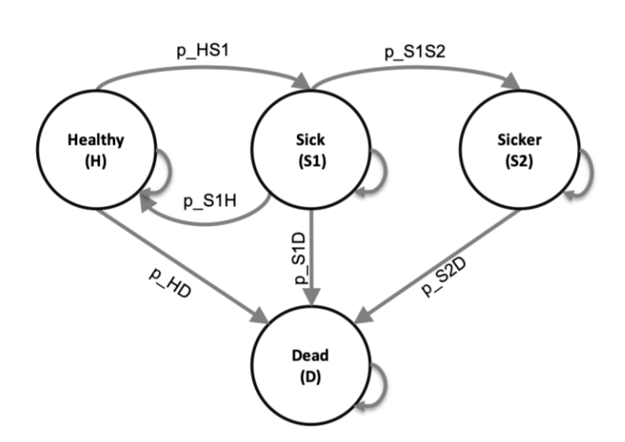
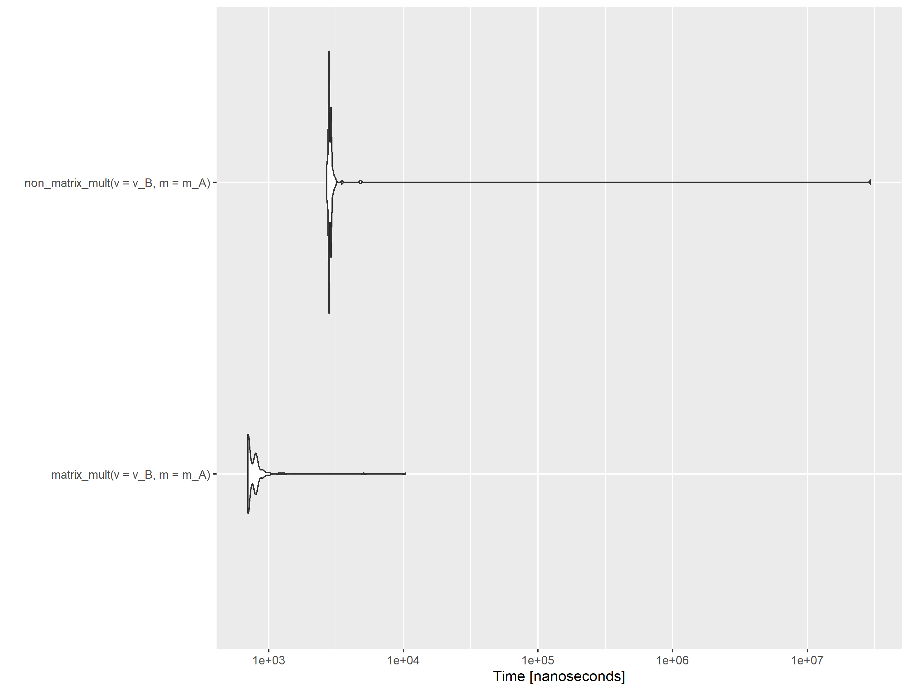

```{r setup, include=FALSE}
knitr::opts_chunk$set(echo = TRUE)
```

## Introduction

In this session we will provide an introduction to a simple Markov model and build this in R. The R shiny app that we'll build throughout the course will enable you to input parameters into this model and observe the outputs. This method is described in a recent peer reviewed paper by @smith2020making.

The underlying model we will use was developed by the DARTH team who have several courses and resources about health economic modelling in R [@DARTH]. It is described in detail in a paper by [@alarid2020cohort]. We have adapted the model slightly to facilitate teaching its integration with shiny, and in small ways that we find more intuitive. Throughout this course we will generally follow the coding framework suggested by @alarid2019need for health economic modelling in R.

### Objectives

- Understand the functions needed to build a simple Markov model

- Understand and apply matrix multiplication to speed up a Markov model

- Implement probabilistic sensitivity analysis (PSA) 

- Create a 'wrapper' function which will facilitate the development of the R shiny app


### Notations
Throughout the course we will generally follow the coding framework suggested by @alarid2019need. Numbers (e.g. the number of simulations) will be denoted by the prefix *n_*. Single probabilities (e.g. in a deterministic analysis the probability of death) will be denoted by the prefix *p_*. Costs and utilities will be denoted *c_* and *u_*. Vectors, matrices, arrays and data-frames will use *v_*, *m_*, *a_* and *df_* respectively. There is no consensus in the field, so we anticipate these may change over the coming years. However the principle of being consistent in naming objects will not.

\newpage

## Sick, sicker Markov model

The simple Markov model that we'll build in this session is referred to as the sick-sicker model. It has four health states; healthy (H), sick (S1), sicker (S2), and dead (D). All individuals are assumed to be healthy at the start of the time horizon. Individuals that are healthy can remain healthy, become sick or die. Individuals that are sick can remain sick, return to healthy, get sicker or die. Individuals that are sicker can only remain sicker or die. The transition probabilities, the probability of moving from one health state to another during a cycle, are fixed over the entire time horizon. A diagram of the model is shown below:

<!-- {width=300px height=200px} -->

## Input parameters

The first step in the model is to define the input parameters in R. Below, we define the strategies, the age of the individuals at baseline, the maximum age of follow-up, the time horizon and the discount rate.

We then define the transition probabilities per cycle which correspond to the labels in Figure 1 and the hazard rate of death for sick and sick compared to healthy. This is an example of hazard rates that may have been estimated on a previous study or studies. Finally we define the costs and utility values associated with each health state. 

```{r}

Strategies <- c("No Treatment", "Treatment")  # strategy names 
age     <- 25                                 # age at baseline
max_age <- 55                                 # maximum age of follow up
n_t  <- max_age - age                         # time horizon, number of cycles
d_r <- 0.03                                   # equal discount of costs and QALYs by 3%

# Transition probabilities (per cycle)
p_HD    <- 0.005           # probability to die when healthy
p_HS1   <- 0.15          	 # probability to become sick when healthy
p_S1H   <- 0.5           	 # probability to become healthy when sick
p_S1S2  <- 0.105         	 # probability to become sicker when sick
hr_S1   <- 3             	 # hazard ratio of death in sick vs healthy
hr_S2   <- 10            	 # hazard ratio of death in sicker vs healthy 

# Cost and utility inputs 
c_H     <- 2000            # cost of remaining one cycle in the healthy state
c_S1    <- 4000            # cost of remaining one cycle in the sick state
c_S2    <- 15000           # cost of remaining one cycle in the sicker state
c_Trt   <- 12000           # cost of treatment(per cycle)
c_D     <- 0               # cost of being in the death state
u_H     <- 1               # utility when healthy
u_S1    <- 0.75            # utility when sick
u_S2    <- 0.5             # utility when sicker
u_D     <- 0               # utility when dead
u_Trt   <- 0.95            # utility when being treated

```

We need to generate the transition probabilities of death in the sick and sicker states (*p_S1D* and *p_S2D*). First we calculate the rate of death in healthy individuals:

```{r}
# rate of death in healthy
    r_HD    <- - log(1 - p_HD) 
```

Then, using the hazard ratio of death for individuals in the sick and sicker states compared to the healthy state, we calculate the rate of death in those who are in the sick and sicker states.

```{r}
# rate of death in sick
    r_S1D   <- hr_S1 * r_HD 	  
    # rate of death in sicker
    r_S2D   <- hr_S2 * r_HD  

```

This enables us to calculate the probability of death (i.e. moving to the death state) in the sick and sicker health states.

```{r}
 # probability of death in sick
    p_S1D   <- 1 - exp(-r_S1D) 
 # probability of death in sicker
    p_S2D   <- 1 - exp(-r_S2D) 

```

The discount weights are then calculated for costs (*v_dwc*) and QALYs (*v_dwe*) for each cycle (0:n_t). Note that these are vectors of length n_t+1. Also note that we are assigning both within the same line. For the purposes of this course we can say what we are doing is assigning a vector to *v_dwe* and then assigning *v_dwc* to *v_dwe*. In reality it is a bit more complicated than this, for more detail see (@wickham2019advanced) or we can discuss in the course. 

```{r}
# calculate discount weight for each cycle
    v_dwe <- v_dwc <- 1 / (1 + d_r) ^ (0:n_t) 

```

Finally we define the names of the health states (H, S1, S2 and D) and create a variable equal to the number of health states

```{r}

v_n  <- c("H", "S1", "S2", "D")               # the 4 states of the model: Healthy (H), Sick (S1), Sicker                                                  (S2), Dead (D)
n_states <- length(v_n)                            # number of health states 
```

## Transition Matrix

We now have all the probabilities that we need to create a transition matrix.

We use the *matrix* function. In this function, we state that the number of rows and number of columns needs to equal the number of states such that there is a column and a row corresponding to each health state. The *dimnames* part of the function is used to define the row and column names. This takes a list in which the first item is a vector of row names and the second item is a vector of column names). In this case the rows and the columns names are the same and correspond to the names of the health states (*v_n*). The matrix initially contains all zeros, hence *data = 0*. In the code below we have labelled the matrix *m_P*.  

```{r}
#transition probability matrix for NO treatment
    m_P <- matrix(data = 0,
                  nrow = n_states, 
                  ncol = n_states,
                  dimnames = list(v_n, v_n))

    m_P
```

We then need to populate the transition matrix. Square brackets are used to identify the row and column in the matrix. The row and column names can be used as has been done below but numbers can also be used. For example, the transition probability for Healthy to Healthy will be the first value in the first row of the matrix (*m_P*) and can be represented by *m_P["H", "H"]* or *m_P[1, 1]*.

For more information on matrices in R see: [https://www.datamentor.io/r-programming/matrix/](https://www.datamentor.io/r-programming/matrix/). Or use type ?matrix into the console for an R vignette.


```{r}
 ### From Healthy
    m_P["H", "H"]  <- 1 - (p_HS1 + p_HD)
    m_P["H", "S1"] <- p_HS1
    m_P["H", "D"]  <- p_HD
    ### From Sick
    m_P["S1", "H"]  <- p_S1H
    m_P["S1", "S1"] <- 1 - (p_S1H + p_S1S2 + p_S1D)
    m_P["S1", "S2"] <- p_S1S2
    m_P["S1", "D"]  <- p_S1D
    ### From Sicker
    m_P["S2", "S2"] <- 1 - p_S2D
    m_P["S2", "D"]  <- p_S2D
    ### From Dead
    m_P["D", "D"] <- 1

    m_P

```

## Markov trace

A Markov trace matrix is used to track the proportion of individuals in each health state in each cycle. In this matrix, there is one column for each health state and one row for each cycle (plus another row for the baseline values in which all individuals are in the healthy state). This time the dimnames part of the function states that the rows should be labelled numerically from 0 to the number of cycles and that the columns names reflect the names of the health states (v_n is the list of health states). 

```{r}
    # create empty Markov trace 
    m_TR <- matrix(data = NA, 
                   nrow = n_t + 1, 
                   ncol = n_states, 
                   dimnames = list(0:n_t, v_n)) 

    head(m_TR)      # The head() function enables you to view the top of a table rather than the full matrix
```

The Markov trace is then initialized such that in the first row, at cycle 0, 100% of individuals are in the health state *H*. There are no individuals in any other health states (hence zeros). 

```{r}
 # initialize Markov trace
    m_TR[1, ] <- c(1, 0, 0, 0)    

    head(m_TR)  # head shows us the first six rows by default.
```

## Running the model

We now have everything we need to run the model. We use a 'for loop' function for this model.

```{r}
 for (t in 1:n_t){ # throughout the number of cycles
      # estimate next cycle (t+1) of Markov trace
      m_TR[t + 1, ] <- m_TR[t, ] %*% m_P           
 }

```

The for function is a way of repeating a sequence of instructions; in this case this enables us to apply the transition matrix to the individuals in the model for each cycle of the model. First we will look at the instructions within the loop

      m_TR[t + 1, ] <- m_TR[t, ] %*% m_P           

The first part m_TR[t+1,] refers to the row in the Markov trace that corresponded to the next cycle. The right-hand side of the equation (m_TR[t, ] %*% m_P) is the instruction to multiply the row in the Markov trace matrix that refers to the current cycle by the transition matrix using matrix multiplication.

### Matrix Multiplication

This involves multiplication of a row vector, in this case the current row in the Markov trace matrix (m_TR[t, ]) and a full matrix. We will show how each value in the new row is calculated using the example of the first cycle when all individuals are healthy. The values in this row are 1 0 0 0 and the transition matrix is shown below

```{r}
m_P

```

The first value in the new row(m_TR[t + 1, ]) corresponds to the number of healthy individuals. This is calculated by multiplying the current row (m_TR[t, ] = 1 0 0 0) by the first column in transition matrix (H = 0.845 0.5 0 0) such that the number of individual in the Healthy state after cycle 1 is

1 * 0.845 + 0 * 0.5 + 0 * 0 + 0 * 0 = 0.845,

The second value is the sum of the current row multiplied by the second column in the matrix (S1 = 0.15, 0.38, 0, 0)

which is 1 * 0.15 + 0 * 0.38 + 0 * 0 + 0 * 0 = 0.15

The third value is the sum of the current row multiplied by the third column in the matrix (S2 = 0, 0.11, 0.95, 0)

which is 1 * 0 + 0 * 0.11 + 0 * 0.95 + 0 * 0 = 0

The fourth value is the sum of the current row multiplied by the fourth column in the matrix (S2 = 0.01, 0.01, 0.05, 1)

which is 1 * 0.005 + 0 * 0.0.01 + 0 * 0.05 + 0 * 1 = 0.005

Matrix multiplication is represented by the %*% expression using in the R code. We can check this is the case by running the model for the first cycle

```{r}
      m_TR[2, ] <- m_TR[1, ] %*% m_P     # Run the model for a single cycle

      m_TR[c(1:2), ]                     # Display the first two rows of the markov trace matrix
```

This is much faster than multiplying cells one by one and summing.

<!-- {width=800px height=200px} -->


### Back to the model

The for loop the runs this instruction for each cycle which is defined as (t in 1:n_t). The letter t has been used here, but any variable can be used. 

```{r}

 for (t in 1:n_t){ # throughout the number of cycles
      # estimate next cycle (t+1) of Markov trace
      m_TR[t + 1, ] <- m_TR[t, ] %*% m_P      
     }
```

Below we run the model for 5 cycles (by changing the values that the loop runs through to (t in 1:5) and show that using the for loop function is simply an efficient way of having several similar lines of code.

```{r}


 for (t in 1:5){ # throughout the number of cycles
      # estimate next cycle (t+1) of Markov trace
      m_TR[t + 1, ] <- m_TR[t, ] %*% m_P           
 }

m_TR[c(1:6),]
```

```{r}

 m_TR[2, ] <- m_TR[1, ] %*% m_P
 m_TR[3, ] <- m_TR[2, ] %*% m_P  
 m_TR[4, ] <- m_TR[3, ] %*% m_P  
 m_TR[5, ] <- m_TR[4, ] %*% m_P  
 m_TR[6, ] <- m_TR[5, ] %*% m_P  
m_TR[c(1:6),]
```

Additional information:

For loops: [https://www.datamentor.io/r-programming/for-loop/](https://www.datamentor.io/r-programming/for-loop/)
Matrix multiplication [https://courses.lumenlearning.com/boundless-algebra/chapter/introduction-to-matrices/](https://courses.lumenlearning.com/boundless-algebra/chapter/introduction-to-matrices/)
Matrix multiplication in R [http://search.r-project.org/R/library/base/html/matmult.html](http://search.r-project.org/R/library/base/html/matmult.html)


## Outputs

###Exercises

1) Use the model to estimate cost-effectiveness of the treatment
  a) Create vectors for the costs and utility of each treatment group (hint: need values for each state,        perhaps give v_u_trt  <- c(u_H, u_Trt, u_S2, u_D) as an example)
  b) Estimate mean costs and QALYs for each year in the time horizon, ignoring discount rates for now,          (hint: you will need to use matrix multiplication that we discussed before)
  c) Apply discount weights (hint: need to use transpose function t() and matrix multiplication)
  d) Create results table
  
  Additional information:

Transpose function [https://www.rdocumentation.org/packages/base/versions/3.6.2/topics/t](https://www.rdocumentation.org/packages/base/versions/3.6.2/topics/t)

###Exercise Answers

In the final part of the model, we calculate the cost and effectiveness outcomes of the model. First we create vectors for the utility and costs of each state for each treatment group.

1) Use the model to estimate cost-effectiveness of the treatment
  a) Create vectors for the costs and utility of each treatment group (hint: need values for each state,        perhaps give v_u_trt  <- c(u_H, u_Trt, u_S2, u_D) as an example)

```{r}

 # create vectors of utility and costs for each state
    v_u_trt    <- c(u_H, u_Trt, u_S2, u_D)
    v_u_no_trt <- c(u_H, u_S1, u_S2, u_D)
    v_c_trt    <- c(c_H, c_S1 + c_Trt, c_S2 + c_Trt, c_D)
    v_c_no_trt <- c(c_H, c_S1, c_S2, c_D)
    
v_u_trt
v_u_no_trt
v_c_trt
v_c_no_trt

```

You can see that the costs are greater for the treatment condition (as they include the cost of treatment) in states sick and sicker and that the utility for the sick state is lower in the treatment condition. 

b) Estimate mean costs and QALYs for each year in the time horizon, ignoring discount rates for now,          (hint: you will need to use matrix multiplication that we discussed before)

We use matrix multiplication again to multiply the Markov trace, which is now populated with the proportion of individuals in each health state in each cycle, by the cost and QALY vectors for each of the treatment groups. This will result in a cost and QALY for each year, for each treatment group


```{r}
  # estimate mean QALYs and costs
    v_E_no_trt <- m_TR %*% v_u_no_trt
    v_E_trt    <- m_TR %*% v_u_trt
    v_C_no_trt <- m_TR %*% v_c_no_trt
    v_C_trt    <- m_TR %*% v_c_trt
    
    head(v_E_no_trt)
    head(v_E_trt)
    head(v_C_no_trt)
    head(v_C_trt)
    
```

c) Apply discount weights (hint: need to use transpose function t() and matrix multiplication)

We  apply the discount weight for costs and QALYs. The discount rate for each (v_dwe and v_dwc) is a vector with a discount rate for each cycle created previously. The costs and QALYs (v_E_no_trt, v_E_trt, v_C_no_trt, v_C_trt) are each transposed from a column to a row before being multiplied by the discount rate for each year to allow for matrix multiplication. The length of each vector is the same (equivalent to the number of cycles + 1) and so the result of the multiplication is a single value; the sum of the cost or QALY multiplied by the discount rate for each year.

```{r}

 ### discount costs and QALYs
    te_no_trt <- t(v_E_no_trt) %*% v_dwe  
    te_trt    <- t(v_E_trt) %*% v_dwe
    tc_no_trt <- t(v_C_no_trt) %*% v_dwc
    tc_trt    <- t(v_C_trt)    %*% v_dwc
    
```    

  d) Create results table
  
Finally we put these results together in a single table.

```{r}
  
results <- c(
 "Cost_NoTrt" = tc_no_trt, 
      "Cost_Trt"   = tc_trt, 
      "QALY_NoTrt" = te_no_trt, 
      "QALY_Trt" = te_trt,
      "ICER" = (tc_trt - tc_no_trt)/
        (te_trt - te_no_trt)
)

results
```


## Generating data frame for Probabilistic sensitivity analysis (PSA)

In order to conduct PSA it is useful to create a model function using the with() function which applies an expression (in this case the rest of the model code) to a data set rather than a defined set of inputs. Specifically, this enables us to run the model with each of a set of PSA inputs. In the code below, you can see that the function applies the model code to the data set 'params'.

```{r}

f_MM_sicksicker <- function(params) {
  # run following code with a set of data 
  with(as.list(params), {
    
    # rate of death in healthy
    r_HD    = - log(1 - p_HD) 
    # rate of death in sick
    r_S1D   = hr_S1 * r_HD 	  
    # rate of death in sicker
    r_S2D   = hr_S2 * r_HD  
    # probability of death in sick
    p_S1D   = 1 - exp(-r_S1D) 
    # probability of death in sicker
    p_S2D   = 1 - exp(-r_S2D) 
    # calculate discount weight for each cycle
    v_dwe <- v_dwc <- 1 / (1 + d_r) ^ (0:n_t) 
    #transition probability matrix for NO treatment
    m_P <- matrix(0,
                  nrow = n_states, 
                  ncol = n_states,
                  dimnames = list(v_n, v_n))
    # fill in the transition probability array
    
    ### From Healthy
    m_P["H", "H"]  <- 1 - (p_HS1 + p_HD)
    m_P["H", "S1"] <- p_HS1
    m_P["H", "D"]  <- p_HD
    ### From Sick
    m_P["S1", "H"]  <- p_S1H
    m_P["S1", "S1"] <- 1 - (p_S1H + p_S1S2 + p_S1D)
    m_P["S1", "S2"] <- p_S1S2
    m_P["S1", "D"]  <- p_S1D
    ### From Sicker
    m_P["S2", "S2"] <- 1 - p_S2D
    m_P["S2", "D"]  <- p_S2D
    ### From Dead
    m_P["D", "D"] <- 1
    # create empty Markov trace 
    m_TR <- matrix(data = NA, 
                   nrow = n_t + 1, 
                   ncol = n_states, 
                   dimnames = list(0:n_t, v_n))     
    
    # initialize Markov trace
    m_TR[1, ] <- c(1, 0, 0, 0)          
    
    ############ PROCESS #####################
    
    for (t in 1:n_t){ # throughout the number of cycles
      # estimate next cycle (t+1) of Markov trace
      m_TR[t + 1, ] <- m_TR[t, ] %*% m_P           
    }
    
    ########### OUTPUT  ######################
    
    # create vectors of utility and costs for each state
    v_u_trt    <- c(u_H, u_Trt, u_S2, u_D)
    v_u_no_trt <- c(u_H, u_S1, u_S2, u_D)
    v_c_trt    <- c(c_H, c_S1 + c_Trt,
                    c_S2 + c_Trt, c_D)
    
    v_c_no_trt <- c(c_H, c_S1, c_S2, c_D)
    # estimate mean QALYs and costs
    v_E_no_trt <- m_TR %*% v_u_no_trt
    
    v_E_trt    <- m_TR %*% v_u_trt
    
    v_C_no_trt <- m_TR %*% v_c_no_trt
    
    v_C_trt    <- m_TR %*% v_c_trt
    
    ### discount costs and QALYs
    #   1x31 %*% 31x1 -> 1x1
    
    te_no_trt <- t(v_E_no_trt) %*% v_dwe  
    te_trt    <- t(v_E_trt) %*% v_dwe
    
    tc_no_trt <- t(v_C_no_trt) %*% v_dwc
    
    tc_trt    <- t(v_C_trt)    %*% v_dwc
    
    results <- c(
      "Cost_NoTrt" = tc_no_trt, 
      "Cost_Trt"   = tc_trt, 
      "QALY_NoTrt" = te_no_trt, 
      "QALY_Trt" = te_trt,
      "ICER" = (tc_trt - tc_no_trt)/
        (te_trt - te_no_trt)
    )
    
    return(results)
  }) # end with function  
} # end f_MM_sicksicker function

```

To demonstrate how this works, we'll create a data frame which has the same inputs that we included for the deterministic model in the first section. We then run the model and you'll see that the results are the same as those that you generated previously.

```{r}

input <- data.frame(
# Transition probabilities (per cycle)
p_HD    <- 0.005,           # probability to die when healthy
p_HS1   <- 0.15,          	 # probability to become sick when healthy
p_S1H   <- 0.5 ,          	 # probability to become healthy when sick
p_S1S2  <- 0.105,         	 # probability to become sicker when sick
hr_S1   <- 3,             	 # hazard ratio of death in sick vs healthy
hr_S2   <- 10 ,           	 # hazard ratio of death in sicker vs healthy 

# Cost and utility inputs 
c_H     <- 2000 ,           # cost of remaining one cycle in the healthy state
c_S1    <- 4000 ,           # cost of remaining one cycle in the sick state
c_S2    <- 15000 ,          # cost of remaining one cycle in the sicker state
c_Trt   <- 12000 ,          # cost of treatment(per cycle)
c_D     <- 0,               # cost of being in the death state
u_H     <- 1,               # utility when healthy
u_S1    <- 0.75  ,          # utility when sick
u_S2    <- 0.5 ,            # utility when sicker
u_D     <- 0,               # utility when dead
u_Trt   <- 0.95             # utility when being treated

)

f_MM_sicksicker(params = input)  # Run model function with input data frame as input paramters


```

Now we'll create a data frame with several values that will be used as PSA inputs. 

Instead of a single value for each input into the model, 1000 values will be randomly selected from distributions for the various inputs. Each distribution has an associated function and each of these has particular values that need to be defined (e.g, mean, sd, shape) as well as the number of simulations, indicated by n. We won't go into each of these functions in detail but there are links at the end of this section. 

The code to create a data frame is then been wrapped into a function. This will enable us to create a data frame with a certain number of simulations and cost of treatment.

```{r}

f_gen_psa <- function(n_sim = 1000, c_Trt = 50){
  
  require(truncnorm)
  
  df_psa <- data.frame(
    
    # Transition probabilities (per cycle)
    
    # prob Healthy -> Sick
    p_HS1   = rbeta(n = n_sim,
                    shape1 =  30,
                    shape2 =  170),
    
    # prob Sick    -> Healthy
    p_S1H   = rbeta(n = n_sim,
                    shape1 =  60,
                    shape2 =  60) ,
    
    # prob Sick    -> Sicker
    p_S1S2  = rbeta(n = n_sim,
                    shape1 =  84,
                    shape2 =  716),       
    
    # prob Healthy -> Dead
    p_HD    = rbeta(n = n_sim,
                    shape1 =  10,
                    shape2 =  1990),
    
    # rate ratio death S1 vs healthy
    hr_S1   = rlnorm(n = n_sim,
                     meanlog =  log(3),
                     sdlog =   0.01),
    
    # rate ratio death S2 vs healthy
    hr_S2   = rlnorm(n = n_sim,
                     meanlog =  log(10),
                     sdlog =  0.02),   
    
    # Cost vectors with length n_sim
    # cost p/cycle in state H
    c_H   = rgamma(n = n_sim, 
                   shape = 100, 
                   scale = 20),
    
    # cost p/cycle in state S1
    c_S1  = rgamma(n = n_sim, 
                   shape = 177.8, 
                   scale = 22.5),
    
    # cost p/cycle in state S2
    c_S2  = rgamma(n = n_sim,
                   shape = 225,
                   scale = 66.7),
    
    # cost p/cycle in state D
    c_D   = 0,
    
    # cost p/cycle of treatment
    c_Trt = c_Trt,
    
    # Utility vectors with length n_sim
    # utility when healthy
    u_H   = rtruncnorm(n = n_sim, 
                       mean = 1, 
                       sd = 0.01, 
                       b = 1),
    
    # utility when sick
    u_S1  = rtruncnorm(n = n_sim, 
                       mean = 0.75, 
                       sd = 0.02, 
                       b = 1),
    
    # utility when sicker
    u_S2  = rtruncnorm(n = n_sim, 
                       mean = 0.50,
                       sd = 0.03, 
                       b = 1),
    # utility when dead
    u_D   = 0,
    
    # utility when being treated
    u_Trt = rtruncnorm(n = n_sim,
                       mean = 0.95,
                       sd = 0.02, 
                       b = 1)  
  )
  
  return(df_psa)
}

```

To show how this works, we can now use the function to create a set of 5 PSA inputs. 

```{r}
f_gen_psa(n_sim = 5,c_Trt = 50)

```

Additional information

With() function: [https://www.rdocumentation.org/packages/base/versions/3.6.2/topics/with](https://www.rdocumentation.org/packages/base/versions/3.6.2/topics/with)

Beta distribution: [https://www.rdocumentation.org/packages/rBeta2009/versions/1.0/topics/rbeta](https://www.rdocumentation.org/packages/rBeta2009/versions/1.0/topics/rbeta)

Multivariate Lognormal Distribution: [https://www.rdocumentation.org/packages/compositions/versions/1.40-5/topics/rlnorm](https://www.rdocumentation.org/packages/compositions/versions/1.40-5/topics/rlnorm)

Gamma Distribution: [https://www.rdocumentation.org/packages/Rlab/versions/2.15.1/topics/Gamma](https://www.rdocumentation.org/packages/Rlab/versions/2.15.1/topics/Gamma)

Truncated Normal Distribution: [https://www.rdocumentation.org/packages/truncnorm/versions/1.0-8/topics/truncnorm](https://www.rdocumentation.org/packages/truncnorm/versions/1.0-8/topics/truncnorm)

## Probabilistic sensitivity analysis (PSA)

The next step is to run the model for each row in this PSA data frame. First we define the the age at baseline, maximum age, discount rate, number of cycles and the names of the states as before, but this time we also define the n_sim which is the number of simulations for the PSA and the cost of treatment as these are now needed to generate the values for the PSA input.


```{r}

# age at baseline
  n_age_init = 25
  # maximum age of follow up
  n_age_max  = 110
  # discount rate for costs and QALYS 
  d_r = 0.035
  #  number of cycles
  n_t <- n_age_max - n_age_init
  # the 4 health states of the model:
  v_n <- c("H", "S1", "S2", "D") 
  # number of health states 
  n_states <- length(v_n) 
  # number of simulations
  n_sim   = 1000
  # cost of treatment
  c_Trt   = 50       
  
  #  number of cycles
  n_t <- n_age_max - n_age_init
  # the 4 health states of the model:
  v_n <- c("H", "S1", "S2", "D") 
  # number of health states 
  n_states <- length(v_n) 

```

We then create the PSA input using the function we've created 

```{r}
  #-- Create PSA Inputs --#
  
  df_psa <- f_gen_psa(n_sim = n_sim, 
                      c_Trt =  c_Trt)

```

We can then run the PSA. We first create a matrix with a row for each simulation and a column for each outcome (cost and QALYs for each treatment and the ICER). 

```{r}

  #--  Run PSA  --#
  
  # Initialize matrix of results outcomes
  m_out <- matrix(NaN, 
                  nrow = n_sim, 
                  ncol = 5,
                  dimnames = list(1:n_sim,
                                  c("Cost_NoTrt", "Cost_Trt",
                                    "QALY_NoTrt", "QALY_Trt",
                                    "ICER")))
  
```

We then use the for() function so that for each of the simulations we populate a row of the matrix (m_out) with the results from running the model with a single set of PSA inputs. 


```{r}
  # run model for each row of PSA inputs
  for(i in 1:n_sim){
    
    # store results in row of results matrix
    m_out[i,] <- f_MM_sicksicker(df_psa[i, ])
    
  } # close model loop
  
```

Finally, we display the results

```{r}
  #-- Return results --#
  
  # convert matrix to dataframe (for plots)
  df_out <- as.data.frame(m_out) 
  
  # output the dataframe from the function  
  head(df_out) 
  
```

## Creating a wrapper

When using a web application it is likely that the user will want to be able to change parameter inputs and re-run the model. In order to make this simple, we recommend wrapping the entire model into a function. We call this function f_wrapper, using the prefix f_ to denote that this is a function.

The wrapper function has as its inputs all the things which we may wish to vary using R-Shiny. We set the default values to those that we've used earlier in this session.

In the code below, you'll see all the code we used in the last section but this time it's wrapped by the f_wrapper(). We've identified inputs that the user might want to change; starting age, maximum age of follow up, discount rate, number of simulations used in the PSA and the cost of treatment. 

There is an additional bit of code to ensure that the functions we've created (f_gen_psa and f_MM_sicksicker) are recognised within this new wrapper function. 

```{r}

f_wrapper <- function(
  
  #-- User adjustable inputs --#
  
  # age at baseline
  n_age_init = 25, 
  # maximum age of follow up
  n_age_max  = 110,
  # discount rate for costs and QALYS 
  d_r = 0.035,
  # number of simulations
  n_sim   = 1000,
  # cost of treatment
  c_Trt   = 50       
  
){
  
  # need to specify environment of inner functions (to use outer function environment)
  # alternatively - define functions within the wrapper function.
  environment(f_gen_psa)         <- environment()
  environment(f_MM_sicksicker)   <- environment()
  
  #-- Nonadjustable inputs --#
  
  #  number of cycles
  n_t <- n_age_max - n_age_init
  # the 4 health states of the model:
  v_n <- c("H", "S1", "S2", "D") 
  # number of health states 
  n_states <- length(v_n) 
  
  #-- Create PSA Inputs --#
  
  df_psa <- f_gen_psa(n_sim = n_sim, 
                        c_Trt =  c_Trt)
  
  #--  Run PSA  --#
  
  # Initialize matrix of results outcomes
  m_out <- matrix(NaN, 
                  nrow = n_sim, 
                  ncol = 5,
                  dimnames = list(1:n_sim,
                                  c("Cost_NoTrt", "Cost_Trt",
                                    "QALY_NoTrt", "QALY_Trt",
                                    "ICER")))
  
  # run model for each row of PSA inputs
  for(i in 1:n_sim){
    
    # store results in row of results matrix
    m_out[i,] <- f_MM_sicksicker(df_psa[i, ])
    
  } # close model loop
  
  
  #-- Return results --#
  
  # convert matrix to dataframe (for plots)
  df_out <- as.data.frame(m_out) 
  
  # output the dataframe from the function  
  return(df_out) 
  
} # end of function
  
```

The wrapper returns a data frame with the costs and the QALY results for Treatment and No Treatment, and the corresponding ICER. Each row corresponds to one PSA-draw. To check what the result looks like, we can run the model, manually specifying the treatment costs (c_Trt=100), initial age (n_age_init = 25), and number of draws (n_sim = 1000).

```{r}
df_model_res = f_wrapper(
    c_Trt = 200,
    n_age_init = 25,
    n_sim = 1000)
    
head(df_model_res)

```


### Resources and references

Smith R and Schneider P. Making health economic models Shiny: A tutorial. Wellcome Open Res 2020, 5:69 [https://wellcomeopenresearch.org/articles/5-69/v2#ref-15](https://wellcomeopenresearch.org/articles/5-69/v2#ref-15)

DARTH Website [https://darthworkgroup.com/](https://darthworkgroup.com/) 

DARTH GitHub repository [https://github.com/DARTH-git?language=r](https://github.com/DARTH-git?language=r)

Alarid-Escudero F, Krijkamp EM, Pechlivanoglou P, et al.: A need for change! a coding framework for improving transparency in decision modeling. Pharmacoeconomics. 2019; 37(11): 1329-1339. [link](https://link.springer.com/article/10.1007/s40273-019-00837-x)

Alarid-Escudero F, Krijkamp EM, Enns EA, et al.: Cohort state-transition models in R: From conceptualization to implementation. arXiv preprint arXiv: 2001. 2020; 07824. [link](https://arxiv.org/abs/2001.07824)


